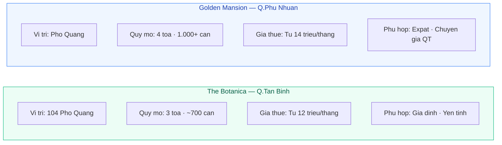
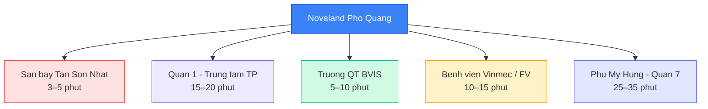

# Image Plan: Cho Thuê Căn Hộ Novaland Phổ Quang

**Draft:** seo_content/output/draft_cho-thue-can-ho-novaland-pho-quang.md
**Tổng số ảnh:** 3
**Ngày tạo:** 2026-05-10

---

## Tóm tắt

| # | File name | Loại | Kích thước | Trạng thái |
|---|-----------|------|-----------|-----------|
| 1 | novaland-pho-quang-tong-the.webp | Stock Photo | 1200×630 | 🔗 5 lựa chọn |
| 2 | so-sanh-the-botanica-golden-mansion.webp | Diagram | 900×500 | ✅ PNG sẵn có + Mermaid code |
| 3 | vi-tri-novaland-pho-quang-ban-do.webp | Diagram | 900×600 | ✅ PNG sẵn có + Mermaid code |

---

## Ảnh 1 — Phối cảnh tổng thể dự án

**Loại:** Stock Photo
**File:** `novaland-pho-quang-tong-the.webp` · **Kích thước:** 1200×630
**Alt text:** `Căn hộ Novaland Phổ Quang nhìn từ mặt đường`

### Lựa chọn ảnh (CC0 — miễn phí thương mại)

| # | Mô tả | Tác giả | Link tải |
|---|-------|---------|---------|
| 1 | Exterior of modern apartment building with balconies | Maximilian Bungart | [Unsplash](https://unsplash.com/photos/exterior-of-a-modern-apartment-building-with-balconies-1iGG6k4Ci4E) |
| 2 | Apartment building with wavy, layered balconies (modern, white) | Nao Xotl | [Unsplash](https://unsplash.com/photos/an-apartment-building-has-wavy-layered-balconies-qlKBZvxXPrI) |
| 3 | High-rise apartment facade — balconies & glass windows pattern | Dmytro Yarish | [Unsplash](https://unsplash.com/photos/modern-apartment-building-with-many-balconies-FgV9cfdZ6Ng) |
| 4 | Modern apartment building balconies with illuminated doors (Tokyo) | Sir. Simo | [Unsplash](https://unsplash.com/photos/modern-apartment-building-balconies-with-illuminated-doors-LScIgU3_e1U) |
| 5 | Modern high-rise apartment building exterior, clear sky | summe 刘 | [Pexels](https://www.pexels.com/photo/modern-high-rise-apartment-building-exterior-33619255/) |

**Gợi ý:** Chọn ảnh 1 (Maximilian Bungart) hoặc 2 (Nao Xotl) — có balcony rõ nét, phong cách gần nhất với chung cư cao cấp kiểu Novaland.

**Cách tải:** Click link → "Download free" → đổi tên `novaland-pho-quang-tong-the.jpg` → convert WebP.

> Tất cả ảnh Unsplash/Pexels miễn phí thương mại. Nên credit: "Ảnh: [Tên tác giả] / Unsplash"

---

## Ảnh 2 — So sánh The Botanica vs Golden Mansion

**Loại:** Diagram
**File:** `so-sanh-the-botanica-golden-mansion.webp` · **Kích thước:** 900×500
**Alt text:** `So sánh The Botanica và Golden Mansion Novaland Phổ Quang`

### Con đường A — PNG matplotlib (sẵn có, dùng ngay)

File đã tạo: `seo_content/output/images/cho-thue-can-ho-novaland-pho-quang/so-sanh-the-botanica-golden-mansion.png`

Đổi tên / convert:
```
cwebp so-sanh-the-botanica-golden-mansion.png -o so-sanh-the-botanica-golden-mansion.webp -q 85
```
Hoặc dùng https://squoosh.app

### Con đường B — Mermaid (chỉnh sửa linh hoạt)

Code tại: `images/cho-thue-can-ho-novaland-pho-quang/diagram_2.md`

**Cách render:**
1. Mở https://mermaid.live
2. Paste code từ `diagram_2.md`
3. Download PNG → đổi tên → convert WebP

### Con đường C — Canva (đẹp nhất, production)

**Template gợi ý:** Tìm "Comparison Infographic" hoặc "Side by Side Comparison" trên canva.com
**Nội dung điền:**
- Cột trái (xanh lá `#10B981`): The Botanica — 104 Phổ Quang, Q.Tân Bình · 3 tòa ~700 căn · 50–120m² · Từ 12tr/tháng · Gia đình, yên tĩnh
- Cột phải (xanh lam `#3B82F6`): Golden Mansion — Phổ Quang, Q.Phú Nhuận · 4 tòa 1.000+ căn · 50–130m² · Từ 14tr/tháng · Expat, quốc tế
- Kích thước export: 900×500px → Download PNG → convert WebP

### Preview Mermaid:



---

## Ảnh 3 — Sơ đồ vị trí khoảng cách

**Loại:** Diagram
**File:** `vi-tri-novaland-pho-quang-ban-do.webp` · **Kích thước:** 900×600
**Alt text:** `Vị trí căn hộ Novaland Phổ Quang trên bản đồ TP.HCM`

### Con đường A — PNG matplotlib (sẵn có, dùng ngay)

File đã tạo: `seo_content/output/images/cho-thue-can-ho-novaland-pho-quang/vi-tri-novaland-pho-quang-ban-do.png`

Đổi tên / convert:
```
cwebp vi-tri-novaland-pho-quang-ban-do.png -o vi-tri-novaland-pho-quang-ban-do.webp -q 85
```
Hoặc dùng https://squoosh.app

### Con đường B — Mermaid

Code tại: `images/cho-thue-can-ho-novaland-pho-quang/diagram_3.md`

**Cách render:**
1. Mở https://mermaid.live
2. Paste code từ `diagram_3.md`
3. Download PNG → convert WebP

### Con đường C — Canva

**Template gợi ý:** Tìm "Hub and Spoke Diagram" hoặc "Mind Map Infographic" trên canva.com
**Nội dung:** Node trung tâm "Novaland Phổ Quang" · 5 mũi tên đến: Sân bay (3–5 phút, đỏ), Quận 1 (15–20 phút, tím), Trường QT (5–10 phút, xanh lá), Bệnh viện (10–15 phút, vàng), Phú Mỹ Hưng (25–35 phút, xanh dương)
**Ghi chú footer:** "Sơ đồ minh họa — không theo tỷ lệ thực tế"

### Preview Mermaid:



---

## Hướng dẫn convert sang WebP

**Online:** https://squoosh.app → kéo ảnh → chọn WebP → Quality 85 → Download

**CLI:**
```
cwebp input.png -o output.webp -q 85
```

**Cài libwebp trên Windows:**
```powershell
winget install libwebp
```
