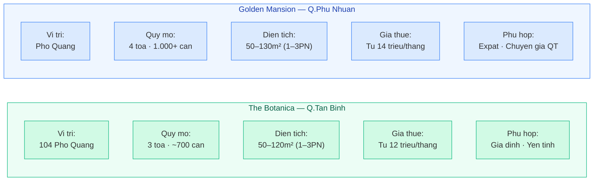

```mermaid
graph LR
    subgraph BOTANICA["The Botanica — Q.Tan Binh"]
        B1["Vi tri:\n104 Pho Quang"]
        B2["Quy mo:\n3 toa · ~700 can"]
        B3["Dien tich:\n50–120m² (1–3PN)"]
        B4["Gia thue:\nTu 12 trieu/thang"]
        B5["Phu hop:\nGia dinh · Yen tinh"]
    end
    subgraph GOLDEN["Golden Mansion — Q.Phu Nhuan"]
        G1["Vi tri:\nPho Quang"]
        G2["Quy mo:\n4 toa · 1.000+ can"]
        G3["Dien tich:\n50–130m² (1–3PN)"]
        G4["Gia thue:\nTu 14 trieu/thang"]
        G5["Phu hop:\nExpat · Chuyen gia QT"]
    end
    style BOTANICA fill:#ECFDF5,stroke:#10B981,color:#065F46
    style GOLDEN fill:#EFF6FF,stroke:#3B82F6,color:#1E40AF
    style B1 fill:#D1FAE5,stroke:#10B981
    style B2 fill:#D1FAE5,stroke:#10B981
    style B3 fill:#D1FAE5,stroke:#10B981
    style B4 fill:#D1FAE5,stroke:#10B981
    style B5 fill:#D1FAE5,stroke:#10B981
    style G1 fill:#DBEAFE,stroke:#3B82F6
    style G2 fill:#DBEAFE,stroke:#3B82F6
    style G3 fill:#DBEAFE,stroke:#3B82F6
    style G4 fill:#DBEAFE,stroke:#3B82F6
    style G5 fill:#DBEAFE,stroke:#3B82F6
```
