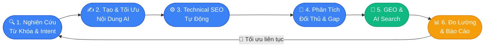

# Image Plan: Ứng Dụng AI Vào SEO

**Draft:** `seo_content/output/draft_ung-dung-ai-vao-seo.md`
**Tổng số ảnh:** 3
**Ngày tạo:** 2026-05-09

---

## Tóm tắt

| # | File name | Loại | Kích thước | Trạng thái |
|---|-----------|------|-----------|-----------|
| 1 | so-do-6-ung-dung-ai-seo.webp | Diagram | 800×500 | ✅ Mermaid + Canva guide |
| 2 | tang-truong-ai-search-vs-google-search-2025.webp | Chart | 900×450 | ✅ Chart.js HTML sẵn sàng |
| 3 | semrush-ai-vs-ahrefs-content-explorer.webp | Screenshot | 1200×600 | 📋 Hướng dẫn thủ công |

---

## Ảnh 1 — Sơ đồ 6 ứng dụng AI SEO trong quy trình

**Loại:** Diagram (Flowchart vòng tròn)
**File:** `so-do-6-ung-dung-ai-seo.webp` · **Kích thước:** 800×500px
**Alt text:** `sơ đồ 6 ứng dụng ai seo trong quy trình tối ưu hóa công cụ tìm kiếm 2025`

### Con đường A — Mermaid (nhanh, miễn phí)

File code: `images/ung-dung-ai-vao-seo/diagram_1.md`

**Cách render:**
1. Mở https://mermaid.live
2. Paste toàn bộ code từ file `diagram_1.md` vào editor bên trái
3. Preview xuất hiện bên phải — điều chỉnh màu nếu muốn
4. Click **"Download PNG"** → đổi tên thành `so-do-6-ung-dung-ai-seo.png`
5. Convert sang WebP (xem hướng dẫn cuối file)

**Preview code Mermaid:**



### Con đường B — Canva (đẹp hơn cho production)

**Template gợi ý:** Tìm **"Circular Process Infographic 6 Steps"** tại canva.com/templates

**Nội dung cần điền vào 6 ô (theo chiều kim đồng hồ):**
1. Nghiên Cứu Từ Khóa & Intent
2. Tạo & Tối Ưu Nội Dung AI
3. Technical SEO Tự Động
4. Phân Tích Đối Thủ & Gap
5. GEO & AI Search
6. Đo Lường & Báo Cáo

**Màu sắc brand:** Xanh chính `#3B82F6` · Xanh đậm `#1D4ED8` · Text trắng `#FFFFFF` · Nền `#F9FAFB`
**Icon gợi ý:** 🔍 ✍️ ⚙️ 🎯 🤖 📊 (hoặc dùng icon pack của Canva)
**Kích thước export:** 800×500px → Download PNG → convert sang WebP

---

## Ảnh 2 — Biểu đồ tăng trưởng AI Search vs Google Search

**Loại:** Chart (Line Chart)
**File:** `tang-truong-ai-search-vs-google-search-2025.webp` · **Kích thước:** 900×450px
**Alt text:** `biểu đồ tăng trưởng ai search so với google search truyền thống 2022 đến 2025`

### Cách tạo ảnh từ file HTML

File đã tạo: `images/ung-dung-ai-vao-seo/chart_2.html`

**Bước 1:** Mở file trong Chrome hoặc Edge (double-click hoặc kéo vào browser)

**Bước 2 — Cách A (đơn giản):** Dùng Snipping Tool (Windows+Shift+S) → chọn vùng chart → lưu PNG

**Bước 2 — Cách B (chính xác hơn):** Mở DevTools (F12) → Console → paste đoạn JS sau:
```javascript
document.querySelector('canvas').toBlob(b => {
  const a = document.createElement('a');
  a.href = URL.createObjectURL(b);
  a.download = 'tang-truong-ai-search-vs-google-search-2025.png';
  a.click();
}, 'image/png');
```

**Bước 3:** Lưu PNG → convert sang WebP

**Dữ liệu dùng trong chart:**

| Năm | AI trong SEO (%) | AI cho Content (%) |
|-----|-----------------|-------------------|
| 2020 | 8 | 5 |
| 2021 | 13 | 10 |
| 2022 | 22 | 20 |
| 2023 | 38 | 40 |
| 2024 | **58** *(BrightEdge)* | **73** *(HubSpot)* |
| 2025 | 72 *(dự báo)* | 85 *(dự báo)* |

> **Lưu ý:** Dữ liệu 2020–2023 là ước tính xu hướng; 2024 là số liệu xác nhận từ BrightEdge và HubSpot.

---

## Ảnh 3 — Screenshot Semrush AI và Ahrefs Content Explorer

**Loại:** Screenshot (thủ công)
**File:** `semrush-ai-vs-ahrefs-content-explorer.webp` · **Kích thước:** 1200×600px
**Alt text:** `so sánh giao diện semrush ai keyword cluster và ahrefs content explorer 2025`

### Phương án A — Ảnh ghép 2 tool (khuyến nghị)

Tạo ảnh ghép side-by-side: Semrush bên trái, Ahrefs bên phải.

**Chụp Semrush Keyword Manager:**
1. Đăng nhập tại https://www.semrush.com
2. Vào **Keyword Manager** (menu: Keyword Research → Keyword Manager)
3. Chọn 1 keyword list có sẵn hoặc tạo list "AI SEO" với 5–10 từ khóa
4. Click tab **"Clusters"** để hiển thị AI Keyword Cluster view
5. Chụp vùng: toàn bộ cluster panel, ẩn navigation sidebar nếu có thể
6. Crop về ~600×600px (nửa trái của ảnh ghép cuối)

**Chụp Ahrefs Content Explorer:**
1. Đăng nhập tại https://ahrefs.com/content-explorer
2. Tìm kiếm query: `"ứng dụng AI vào SEO"` hoặc `"AI SEO"`
3. Hiển thị view mặc định với kết quả bài viết + metrics
4. Chụp vùng: kết quả top 5–10 với cột DR, Traffic, Referring Domains
5. Crop về ~600×600px (nửa phải của ảnh ghép)

**Ghép 2 ảnh:**
- Dùng Paint hoặc Canva: tạo canvas 1200×600 → paste 2 ảnh vào 2 nửa
- Thêm separator trắng 4px ở giữa
- Thêm label nhỏ: "Semrush AI" (trái) và "Ahrefs Content Explorer" (phải)
- Export PNG → convert sang WebP

### Phương án B — Screenshot 1 tool (nhanh hơn)

Nếu không có cả 2 tài khoản: chỉ chụp 1 tool, điều chỉnh alt text thành:
- `"giao diện semrush ai keyword cluster 2025"` hoặc
- `"giao diện ahrefs content explorer 2025"`

**Tool capture:** Windows Snipping Tool (Windows+Shift+S) → chọn vùng → Copy → Paste Paint → Lưu PNG

---

## Hướng dẫn Convert sang WebP (áp dụng cho tất cả ảnh)

### Cách 1 — Online, không cài gì
Dùng **https://squoosh.app** → kéo ảnh vào → Format: **WebP** → Quality: **85** → Download

### Cách 2 — Windows CLI (libwebp)
```powershell
# Cài một lần
winget install libwebp

# Convert từng file
cwebp so-do-6-ung-dung-ai-seo.png -o so-do-6-ung-dung-ai-seo.webp -q 85
cwebp tang-truong-ai-search-vs-google-search-2025.png -o tang-truong-ai-search-vs-google-search-2025.webp -q 85
cwebp semrush-ai-vs-ahrefs-content-explorer.png -o semrush-ai-vs-ahrefs-content-explorer.webp -q 85
```

### Cách 3 — Batch convert tất cả PNG trong folder
```powershell
Get-ChildItem *.png | ForEach-Object {
  cwebp $_.FullName -o ($_.BaseName + ".webp") -q 85
}
```

---

## Bước tiếp theo

1. Tạo 3 ảnh theo hướng dẫn trên
2. Upload lên CMS vào đúng vị trí trong bài
3. Điền alt text từ bảng tóm tắt ở trên
4. Chạy lại `/seo-audit --file output/draft_ung-dung-ai-vao-seo.md` để kiểm tra GĐ4 Media — dự kiến tăng từ 7 → 9–10/10
