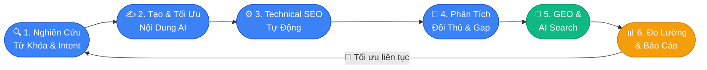

```mermaid
flowchart LR
    A([🔍 1. Nghiên Cứu\nTừ Khóa & Intent]) --> B([✍️ 2. Tạo & Tối Ưu\nNội Dung AI])
    B --> C([⚙️ 3. Technical SEO\nTự Động])
    C --> D([🎯 4. Phân Tích\nĐối Thủ & Gap])
    D --> E([🤖 5. GEO &\nAI Search])
    E --> F([📊 6. Đo Lường\n& Báo Cáo])
    F -->|"🔄 Tối ưu liên tục"| A

    style A fill:#3B82F6,stroke:#1D4ED8,color:#fff
    style B fill:#3B82F6,stroke:#1D4ED8,color:#fff
    style C fill:#3B82F6,stroke:#1D4ED8,color:#fff
    style D fill:#3B82F6,stroke:#1D4ED8,color:#fff
    style E fill:#10B981,stroke:#059669,color:#fff
    style F fill:#F59E0B,stroke:#D97706,color:#fff
```
