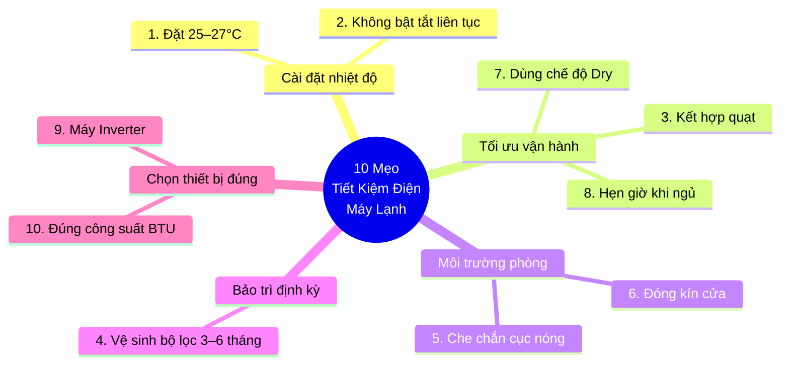
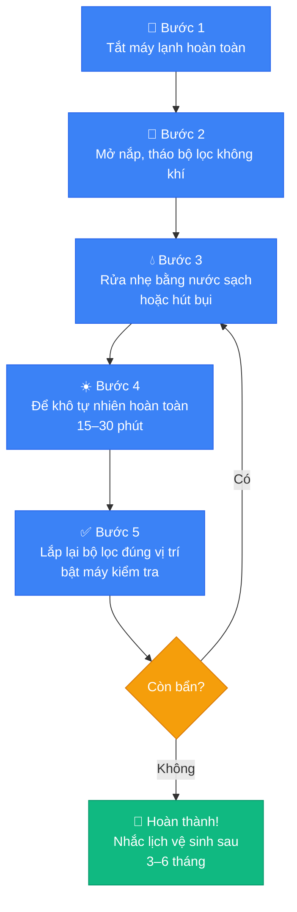

# Image Plan: Sử Dụng Máy Lạnh Tiết Kiệm Điện

**Draft:** `seo_content/output/draft_su-dung-may-lanh-tiet-kiem-dien.md`
**Tổng số ảnh:** 4
**Ngày tạo:** 2026-05-10

---

## Tóm tắt

| # | File name | Loại | Trạng thái |
|---|-----------|------|-----------|
| 1 | `may-lanh-tiet-kiem-dien-10-meo.webp` | Diagram (mindmap) | ✅ Mermaid sẵn + hướng dẫn Canva |
| 2 | `nhiet-do-may-lanh-tiet-kiem-dien.webp` | Chart (bar) | ✅ Chart.js HTML sẵn sàng |
| 3 | `ve-sinh-bo-loc-may-lanh.webp` | Diagram (flowchart) | ✅ Mermaid sẵn + hướng dẫn Canva |
| 4 | `chi-phi-dien-may-lanh.webp` | Chart (grouped bar) | ✅ Chart.js HTML sẵn sàng |

---

## Ảnh 1 — Infographic 10 mẹo tiết kiệm điện máy lạnh

**Loại:** Diagram (Mindmap)
**File:** `may-lanh-tiet-kiem-dien-10-meo.webp`
**Alt text:** `10 mẹo sử dụng máy lạnh tiết kiệm điện hiệu quả`
**Vị trí trong bài:** Sau đoạn mở bài, trước phần H2 đầu tiên

### Con đường A — Mermaid (nhanh, miễn phí)

Xem code tại: `images/su-dung-may-lanh-tiet-kiem-dien/diagram_1.md`

**Cách render:**
1. Mở https://mermaid.live
2. Paste toàn bộ code từ file trên
3. Điều chỉnh nếu cần → Click "Download PNG" (800×600px)
4. Đổi tên: `may-lanh-tiet-kiem-dien-10-meo.png` → convert sang WebP

### Con đường B — Canva (đẹp hơn cho production)

**Template gợi ý:** Tìm **"Mind Map Diagram"** hoặc **"10 Tips Infographic"** trên canva.com
**Nội dung cần điền:**
- Node trung tâm: "10 Mẹo Tiết Kiệm Điện Máy Lạnh"
- Nhánh 1 (Cài đặt nhiệt độ): ① Đặt 25–27°C / ② Không bật tắt liên tục
- Nhánh 2 (Vận hành): ③ Kết hợp quạt / ⑦ Dùng chế độ Dry / ⑧ Hẹn giờ khi ngủ
- Nhánh 3 (Môi trường): ⑤ Che chắn cục nóng / ⑥ Đóng kín cửa
- Nhánh 4 (Bảo trì): ④ Vệ sinh bộ lọc 3–6 tháng
- Nhánh 5 (Thiết bị): ⑨ Máy Inverter / ⑩ Đúng công suất BTU

**Màu sắc brand:** Xanh chính `#3B82F6` · Text trắng `#FFFFFF` · Nền `#F9FAFB`
**Kích thước export:** 1200×900px → Download PNG → convert sang WebP

### Preview code Mermaid:



---

## Ảnh 2 — Biểu đồ tiêu thụ điện theo nhiệt độ cài đặt

**Loại:** Chart (Bar Chart)
**File:** `nhiet-do-may-lanh-tiet-kiem-dien.webp`
**Alt text:** `nhiệt độ máy lạnh tiết kiệm điện nhất là bao nhiêu độ`
**Vị trí trong bài:** Ngay sau H2 "Nhiệt Độ Máy Lạnh Bao Nhiêu Độ Là Tiết Kiệm Điện?"

### Cách tạo ảnh từ file HTML

File đã tạo: `images/su-dung-may-lanh-tiet-kiem-dien/chart_1.html`

**Bước 1:** Mở file trong Chrome/Edge
**Bước 2:** Mở DevTools (F12) → Console → gõ:
```javascript
document.querySelector('canvas').toBlob(b => {
  const a = document.createElement('a');
  a.href = URL.createObjectURL(b);
  a.download = 'nhiet-do-may-lanh-tiet-kiem-dien.png';
  a.click();
}, 'image/png');
```
**Bước 3:** Lưu PNG → convert sang WebP

**Dữ liệu trong chart:**
| Nhiệt độ | Tiêu thụ điện tương đối |
|----------|------------------------|
| 20°C | 150% |
| 22°C | 120% |
| 24°C (tham chiếu) | 100% |
| 26°C (khuyến nghị) | 85% |
| 28°C | 70% |

---

## Ảnh 3 — Flowchart các bước vệ sinh bộ lọc máy lạnh

**Loại:** Diagram (Flowchart)
**File:** `ve-sinh-bo-loc-may-lanh.webp`
**Alt text:** `cách vệ sinh bộ lọc máy lạnh tại nhà để tiết kiệm điện`
**Vị trí trong bài:** Trong section mẹo số 4 "Vệ Sinh Bộ Lọc Không Khí 3–6 Tháng/Lần"

### Con đường A — Mermaid (nhanh, miễn phí)

Xem code tại: `images/su-dung-may-lanh-tiet-kiem-dien/diagram_2.md`

**Cách render:**
1. Mở https://mermaid.live
2. Paste toàn bộ code từ file trên
3. Download PNG → đổi tên `ve-sinh-bo-loc-may-lanh.png` → convert WebP

### Con đường B — Canva

**Template gợi ý:** Tìm **"Step by Step Process Infographic"** hoặc **"Circular Process"** trên Canva
**Nội dung 5 bước:**
1. Tắt máy lạnh hoàn toàn
2. Mở nắp, tháo bộ lọc không khí
3. Rửa nhẹ bằng nước sạch hoặc hút bụi
4. Để khô tự nhiên 15–30 phút
5. Lắp lại và bật máy kiểm tra

**Màu sắc:** Xanh `#3B82F6` cho các bước, Xanh lá `#10B981` cho kết quả
**Kích thước:** 800×600px → PNG → WebP

### Preview code Mermaid:



---

## Ảnh 4 — Biểu đồ chi phí điện theo công suất và giờ dùng

**Loại:** Chart (Grouped Bar Chart)
**File:** `chi-phi-dien-may-lanh.webp`
**Alt text:** `chi phí điện máy lạnh 1HP 1.5HP 2HP mỗi tháng`
**Vị trí trong bài:** Trong H2 "Chi Phí Điện Thực Tế Khi Dùng Máy Lạnh Là Bao Nhiêu?"

### Cách tạo ảnh từ file HTML

File đã tạo: `images/su-dung-may-lanh-tiet-kiem-dien/chart_2.html`

**Bước 1:** Mở file trong Chrome/Edge
**Bước 2:** Mở DevTools (F12) → Console → gõ:
```javascript
document.querySelector('canvas').toBlob(b => {
  const a = document.createElement('a');
  a.href = URL.createObjectURL(b);
  a.download = 'chi-phi-dien-may-lanh.png';
  a.click();
}, 'image/png');
```
**Bước 3:** Lưu PNG → convert sang WebP

**Dữ liệu trong chart:**
| Công suất | 6h/ngày | 8h/ngày | 10h/ngày |
|-----------|---------|---------|---------|
| 1 HP | 89.400đ | 119.200đ | 149.000đ |
| 1.5 HP | 134.000đ | 178.600đ | 223.300đ |
| 2 HP | 178.700đ | 238.300đ | 297.800đ |
| 2.5 HP | 223.400đ | 297.800đ | 372.300đ |

*Giá điện bậc 3: 2.858 đ/kWh (EVN, 2024). Hệ số tải 0.7.*

---

## Hướng dẫn convert sang WebP (áp dụng cho tất cả ảnh)

**Cách 1 — Online (không cần cài gì):**
Dùng https://squoosh.app → kéo ảnh vào → chọn định dạng "WebP" → Quality 85 → Download

**Cách 2 — Windows CLI (libwebp):**
```
cwebp input.png -o output.webp -q 85
```
Cài libwebp: `winget install libwebp`

**Cách 3 — PowerShell batch convert (sau khi có libwebp):**
```powershell
Get-ChildItem "D:\Nunu-Claude\seo_content\output\images\su-dung-may-lanh-tiet-kiem-dien\*.png" | ForEach-Object {
  cwebp $_.FullName -o ($_.DirectoryName + "\" + $_.BaseName + ".webp") -q 85
}
```

---

## Bước tiếp theo

1. Render các diagram từ mermaid.live → lưu PNG
2. Mở chart_1.html và chart_2.html trong Chrome → export PNG bằng console snippet
3. Convert tất cả PNG sang WebP (Quality 85) → đặt vào thư mục `images/su-dung-may-lanh-tiet-kiem-dien/`
4. Upload WebP lên CMS → lấy URL thực tế
5. Cập nhật draft: thay comment `<!-- [ẢNH] ... -->` bằng ``
6. Chạy `/seo-webp` nếu cần xử lý hàng loạt
7. Chạy lại `/seo-audit` để kiểm tra Phase 4 Media sau khi có ảnh thực tế
