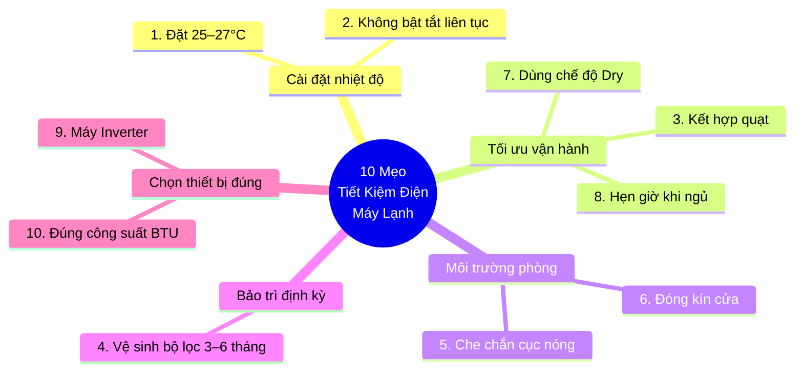

```mermaid
mindmap
  root((10 Mẹo<br>Tiết Kiệm Điện<br>Máy Lạnh))
    Cài đặt nhiệt độ
      1. Đặt 25–27°C
      2. Không bật tắt liên tục
    Tối ưu vận hành
      3. Kết hợp quạt
      7. Dùng chế độ Dry
      8. Hẹn giờ khi ngủ
    Môi trường phòng
      5. Che chắn cục nóng
      6. Đóng kín cửa
    Bảo trì định kỳ
      4. Vệ sinh bộ lọc 3–6 tháng
    Chọn thiết bị đúng
      9. Máy Inverter
      10. Đúng công suất BTU
```
