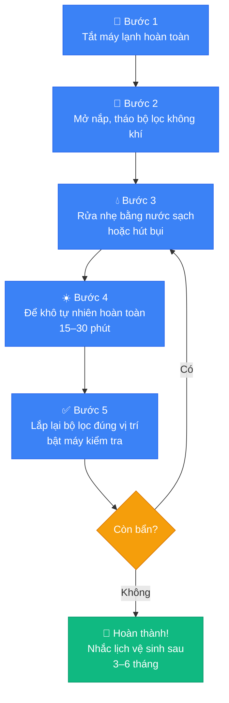

```mermaid
flowchart TD
    A["🔌 Bước 1<br>Tắt máy lạnh hoàn toàn"] --> B["🔧 Bước 2<br>Mở nắp, tháo bộ lọc không khí"]
    B --> C["💧 Bước 3<br>Rửa nhẹ bằng nước sạch<br>hoặc hút bụi"]
    C --> D["☀️ Bước 4<br>Để khô tự nhiên hoàn toàn<br>15–30 phút"]
    D --> E["✅ Bước 5<br>Lắp lại bộ lọc đúng vị trí<br>bật máy kiểm tra"]
    E --> F{Còn bẩn?}
    F -->|Có| C
    F -->|Không| G["🎉 Hoàn thành!<br>Nhắc lịch vệ sinh sau<br>3–6 tháng"]

    style A fill:#3B82F6,stroke:#2563EB,color:#FFFFFF
    style B fill:#3B82F6,stroke:#2563EB,color:#FFFFFF
    style C fill:#3B82F6,stroke:#2563EB,color:#FFFFFF
    style D fill:#3B82F6,stroke:#2563EB,color:#FFFFFF
    style E fill:#3B82F6,stroke:#2563EB,color:#FFFFFF
    style F fill:#F59E0B,stroke:#D97706,color:#FFFFFF
    style G fill:#10B981,stroke:#059669,color:#FFFFFF
```
