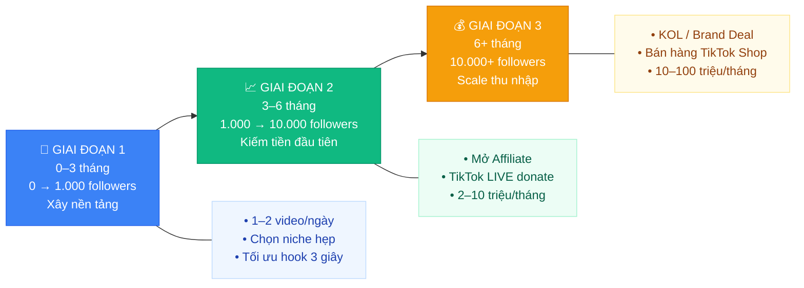

```mermaid
flowchart LR
    A["🌱 GIAI ĐOẠN 1<br/>0–3 tháng<br/>0 → 1.000 followers<br/>Xây nền tảng"] --> B["📈 GIAI ĐOẠN 2<br/>3–6 tháng<br/>1.000 → 10.000 followers<br/>Kiếm tiền đầu tiên"]
    B --> C["💰 GIAI ĐOẠN 3<br/>6+ tháng<br/>10.000+ followers<br/>Scale thu nhập"]

    A --- A1["• 1–2 video/ngày<br/>• Chọn niche hẹp<br/>• Tối ưu hook 3 giây"]
    B --- B1["• Mở Affiliate<br/>• TikTok LIVE donate<br/>• 2–10 triệu/tháng"]
    C --- C1["• KOL / Brand Deal<br/>• Bán hàng TikTok Shop<br/>• 10–100 triệu/tháng"]

    style A fill:#3B82F6,stroke:#2563EB,color:#FFFFFF
    style B fill:#10B981,stroke:#059669,color:#FFFFFF
    style C fill:#F59E0B,stroke:#D97706,color:#FFFFFF
    style A1 fill:#EFF6FF,stroke:#BFDBFE,color:#1E40AF
    style B1 fill:#ECFDF5,stroke:#A7F3D0,color:#065F46
    style C1 fill:#FFFBEB,stroke:#FDE68A,color:#92400E
```
